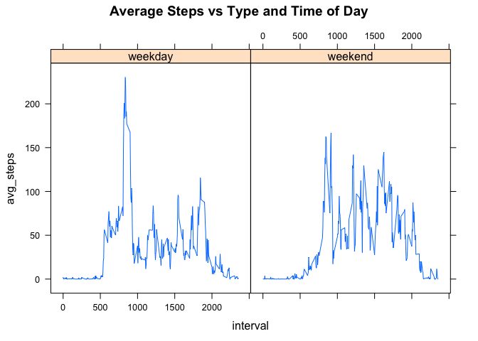

# Reproducible Research: Peer Assessment 1


## Loading and preprocessing the data

```r
activity.data <- read.csv(unzip("activity.zip", "activity.csv"))
```


## What is mean total number of steps taken per day?

```r
steps.per.day = tapply(activity.data$steps, activity.data$date, sum)
hist(steps.per.day, breaks  = 20, main = "Steps Per Day")
```

 

```r
summary(steps.per.day)
```

```
##    Min. 1st Qu.  Median    Mean 3rd Qu.    Max.    NA's 
##      41    8841   10760   10770   13290   21190       8
```


## What is the average daily activity pattern?

Below is a Chart showing the average daily performance by 5 Min Interval:


```r
avg.steps.per.interval <- tapply(activity.data$steps, activity.data$interval, mean, na.rm = T)
plot(avg.steps.per.interval, type="l", xlab = "5 Min Interval", ylab = "Mean Steps Across Days", main = "Average Steps Per Interval", xaxt = "n")

tck.marks <- seq(1, length(avg.steps.per.interval), 12)
axis(1, at = tck.marks, labels = names(avg.steps.per.interval)[tck.marks])
```

 


Below is the data on the peak in the graph:

```r
t <- avg.steps.per.interval[which.max(avg.steps.per.interval)]
paste("Peak Period:",names(t)); paste("Peak Mean Per Day:",t[[names(t)]])
```

```
## [1] "Peak Period: 835"
```

```
## [1] "Peak Mean Per Day: 206.169811320755"
```


## Imputing missing values

Number of rows with missing values:

```r
incomplete.cases <- sum(!complete.cases(activity.data))
incomplete.cases
```

```
## [1] 2304
```

Impute Missing values based on mean activity per Interval

```r
activity.data.imputed <- activity.data

incomplete.cases <- !complete.cases(activity.data)

n = dim(activity.data.imputed)[1]

for(i in subset(1:n, incomplete.cases)){
   interval <- as.character(activity.data.imputed$interval[i])
   activity.data.imputed[i,]$steps <-  avg.steps.per.interval[[interval]]
}
```

Hist and mean and median data for the imputed data:

```r
steps.per.day.imputed = tapply(activity.data.imputed$steps, activity.data.imputed$date, sum)
hist(steps.per.day.imputed, breaks  = 20, main = "Steps Per Day")
```

 

```r
summary(steps.per.day.imputed)
```

```
##    Min. 1st Qu.  Median    Mean 3rd Qu.    Max. 
##      41    9819   10770   10770   12810   21190
```

In the histogram for the imputed data we see that the method of imputation caused a spike at approx. 10K Steps per day

## Are there differences in activity patterns between weekdays and weekends?

Add Weekday/Weekend label to the imputed dataset

```r
weekend.bool <- weekdays(as.Date(activity.data.imputed$date)) %in% c("Sunday", "Saturday")
wknd.label <- rep("weekday", length(weekend.bool))
wknd.label[weekend.bool] <- "weekend"  
activity.data.imputed$wknd.label <- as.factor(wknd.label)
```


```r
library(lattice)
xy.steps <- with(activity.data.imputed, aggregate(steps, by = list(interval, wknd.label), mean))
names(xy.steps) <- c("interval", "wknd.label", "avg_steps")
xyplot(avg_steps ~ interval|wknd.label, data = xy.steps, type="l", 
        main = "Average Steps vs Type and Time of Day")
```

 
